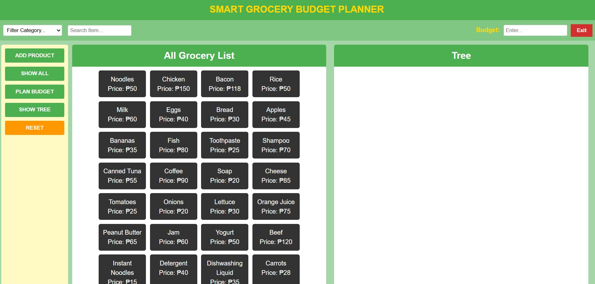

# 🛒 Smart Grocery Budget Planner

## 📌 Overview

**Smart Grocery Budget Planner** is a simple and intuitive application designed to help users manage their grocery shopping effectively within a specified budget. With features such as filtering, adding products, planning purchases, and visualizing budget allocation, this planner helps users stay on top of their spending.

## 🚀 Features

- 🗂️ **Filter Category:** Quickly find grocery items by category.
- 🔍 **Search Item:** Easily search for a specific product.
- ➕ **Add Product:** Add new grocery items to the list.
- ✅ **Show All:** View the complete list of available groceries.
- 📊 **Plan Budget:** Enter your budget and start planning your purchase.
- 🌳 **Tree View:** Visualize selected items in a structured view.
- 🔄 **Reset:** Clear selections and start fresh.
- 💵 **Budget Input:** Input field to specify your maximum budget.

## 🛠️ Technologies Used

- HTML
- CSS
- JavaScript

## 📷 Screenshot

The application is divided into three main sections:

1. **Sidebar** (Left) - Controls like "Add Product", "Plan Budget", and "Reset".
2. **All Grocery List** (Middle) - A grid of grocery items with their names and prices.
3. **Tree View** (Right) - A visual summary of selected items and budget information.

Refer to the screenshot above for a better understanding of the layout.

## 🧠 How to Use

1. Enter your budget using the input field on the top right.
2. Browse or search for items from the main grocery list.
3. Use **Plan Budget** to add items within your budget.
4. Click **Show Tree** to visualize the selected items and track total expenses.
5. Press **Reset** to start over.

## 🧩 Future Improvements

- Add category filters and color coding.
- Include nutritional information or expiration dates.
- Allow users to save and load grocery lists.
- Add mobile and tablet responsiveness.

## 📁 Project Structure

## 📝 Author

Developed by Julia Tamayo Rodrigo  
Made with 💚 to simplify grocery shopping!

